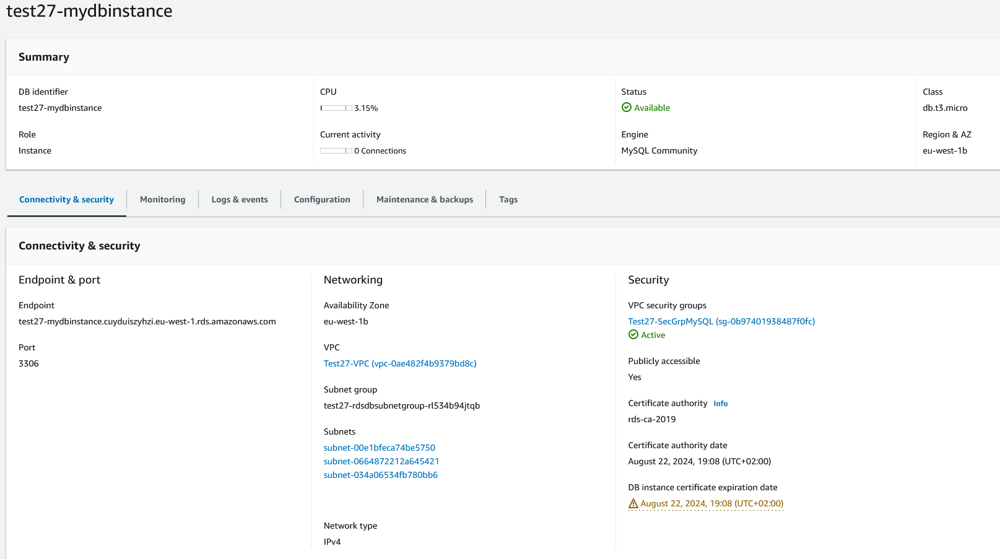
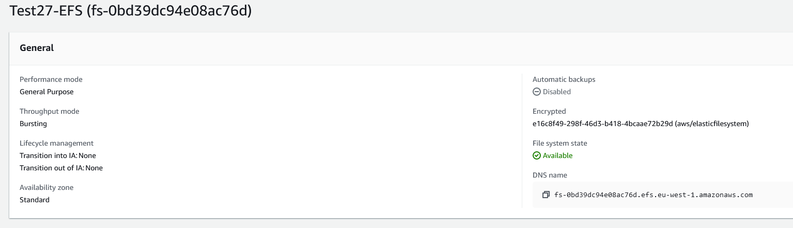
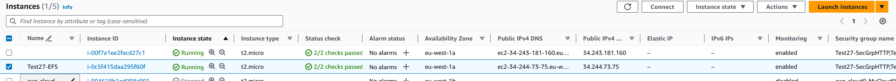
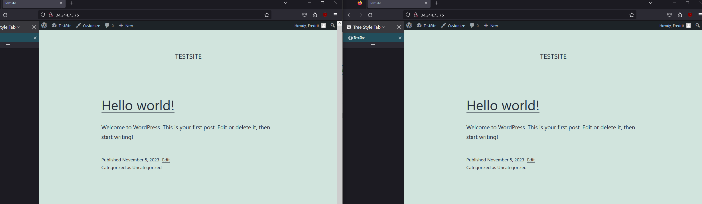

# AWS Exercise 2
In this exercise we will be building onto our exsisting yaml "uppgift1.yaml" with a AWS RDS, mySQL, together with a EFS staorage for apatch2 webservice that then are connected to a autoscaling group for stability and redundens.

## Parameters
we can add following parameters to our script for specifi master username and password for AWS RDS
```yaml
  MasterUsername:
    Type: String
    Default: root
  MasterUserPassword:
    Type: String
    Default: Test123!

```

## Resourse
First we have a new Secgroup for DB in the case we would like to restrict it for external access.
```yaml
### SEC Group MySQL ###
  secGroupNameMySQL:
    Type: AWS::EC2::SecurityGroup
    Properties:
      GroupName: !Sub '${AWS::StackName}-SecGrpMySQL'
      GroupDescription: 'Allow SSH - Anywhere'
      VpcId: !Ref myVPC
      SecurityGroupIngress:
        - IpProtocol: 'TCP'
          FromPort: 3306
          ToPort: 3306
          CidrIp: 0.0.0.0/0
      Tags:
        - Key: 'Name'
          Value: !Sub '${AWS::StackName}-SecGrpSSH'
    DependsOn: myVPC
### DBSubnetGroup MySQL ###
  rdsDBSubnetGroup:
    Type: AWS::RDS::DBSubnetGroup
    Properties:
      DBSubnetGroupDescription: !Sub 'Setup ${AWS::StackName}-SubnetGroup'
      SubnetIds:
        - !Ref SubA
        - !Ref SubB
        - !Ref SubC
      Tags:
        - Key: 'Name'
          Value: !Sub '${AWS::StackName}-SubnetGroup'
    DependsOn: routeTableAssocNameC
```
Now we have the config for DB instaces. 
We are going to use mySQL 
```yaml
### DB ###
  rdsDBInstance:
    Type: AWS::RDS::DBInstance
    Properties:
      AllocatedStorage: '50'
      DBInstanceClass: db.t3.micro
      MultiAZ: true
      BackupRetentionPeriod: 0
      DBInstanceIdentifier: !Sub '${AWS::StackName}-mydbinstance'
      DBName: 'DB'
      DBSubnetGroupName: !Ref rdsDBSubnetGroup
      Engine: mysql
      MasterUsername: !Ref MasterUsername
      MasterUserPassword: !Ref MasterUserPassword
      Port: 3306 
      PubliclyAccessible: true
      StorageEncrypted: true
      VPCSecurityGroups:
        - !Ref secGroupNameMySQL
      Tags:
        - Key: 'Name'
          Value: !Sub '${AWS::StackName}-DB-Test'
    DependsOn: MyEFS
```


## EFS
We need to add a Security group for our efs so we can restric with requests are allowed to access to the EFS, in this case we have left it open for public access
```yaml
### EFS ###
  SecGrpEFS:
    Type: AWS::EC2::SecurityGroup
    Properties:
      GroupName: !Sub ${AWS::StackName}-EFS
      GroupDescription: "Allow EFS Anywhere"
      VpcId: !Ref myVPC
      SecurityGroupIngress:
        - IpProtocol: 'TCP'
          ToPort: 2049
          FromPort: 2049
          CidrIp: 0.0.0.0/0
      Tags:
        - Key: Name
          Value: !Sub ${AWS::StackName}-EFS
    DependsOn: SubC
```
here is our config for setup a EFS fileshare together witg moutpoint for the 3 diffrent subnet we have created in the region.
```yaml
  MyEFS:
    Type: AWS::EFS::FileSystem
    Properties:
      BackupPolicy: 
        Status: DISABLED
      Encrypted: True
      PerformanceMode: generalPurpose
      ThroughputMode: bursting
      FileSystemTags:
        - Key: Name
          Value: !Sub ${AWS::StackName}-EFS
    DependsOn: SecGrpEFS
  
  MyEFSMountSubA:
    Type: AWS::EFS::MountTarget
    Properties:
      FileSystemId: !Ref MyEFS
      SecurityGroups: 
        - !Ref SecGrpEFS
        - !Ref secGroupNameSSH
      SubnetId: !Ref SubA
    DependsOn: MyEFS
  MyEFSMountSubB:
    Type: AWS::EFS::MountTarget
    Properties:
      FileSystemId: !Ref MyEFS
      SecurityGroups: 
        - !Ref SecGrpEFS
        - !Ref secGroupNameSSH
      SubnetId: !Ref SubB
    DependsOn: MyEFSMountSubA
  MyEFSMountSubC:
    Type: AWS::EFS::MountTarget
    Properties:
      FileSystemId: !Ref MyEFS
      SecurityGroups: 
        - !Ref SecGrpEFS
        - !Ref secGroupNameSSH
      SubnetId: !Ref SubC
    DependsOn: MyEFSMountSubB
```


We will also create a provisioning server for configure our webservice.
First we will need to mount our EFS to the instances and install apache2 with php.
in this example we have not added any Authentication Unique Keys and Salts to the website.
```yaml
  myEC2Instance:
    Type: AWS::EC2::Instance
    Properties:
      KeyName: 
        Ref: KeyName
      ImageId: !Ref ImageID
      InstanceType: !Ref ec2type
      Monitoring: true
      SubnetId: !Ref SubA
      SecurityGroupIds:
        - !Ref secGroupNameSSH
        - !Ref secGroupNameHTTP 
      UserData: 
        Fn::Base64: 
          Fn::Sub: |
            #!/bin/bash -ex
            yum update -y
            yum install amazon-efs-utils -y
            mkdir -p /var/www
            echo ${MyEFS.FileSystemId} >> /var/www/test
            mount -t efs -o tls ${MyEFS.FileSystemId}:/ /var/www
            yum install -y httpd wget php-fpm php-mysqli php-json php php-devel
            systemctl start httpd
            systemctl enable httpd
            chown -R ec2-user:apache /var/www
            chmod 2775 /var/www && find /var/www -type d -exec sudo chmod 2775 {} \;
            find /var/www -type f -exec sudo chmod 0664 {} \;
            yum install -y mariadb105
            wget -P /home/ec2-user/ https://wordpress.org/latest.tar.gz
            tar -xzf /home/ec2-user/latest.tar.gz -C /home/ec2-user/
            cp /home/ec2-user/wordpress/wp-config-sample.php /home/ec2-user/wordpress/wp-config.php
            sed -i 's/username_here/${MasterUsername}/' /home/ec2-user/wordpress/wp-config.php
            sed -i 's/password_here/${MasterUserPassword}/' /home/ec2-user/wordpress/wp-config.php
            sed -i 's/database_name_here/DB/' /home/ec2-user/wordpress/wp-config.php
            sed -i "s/localhost/${rdsDBInstance.Endpoint.Address}/" /home/ec2-user/wordpress/wp-config.php
            cp -r /home/ec2-user/wordpress/* /var/www/html/
            service httpd restart
            echo ${rdsDBInstance.Endpoint.Address} >> /var/www/test
      Tags:
        - Key: Name
          Value: !Sub ${AWS::StackName}-EFS
    DependsOn: rdsDBInstance
```


## Full Code
Full code can be find on github: 
# Resualt
